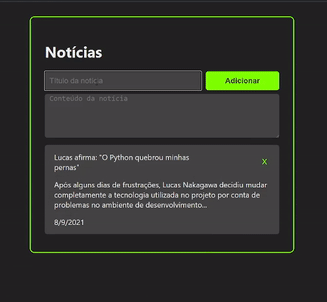

# News Portal
An application to manage news.

## 📖 About
This project was created in order to demonstrate my skills with full stack development, the project is basically a manager where the user can view, create and delete news.
Note: This repository contains only the front-end application, the back-end application is located at: https://github.com/nakagawa25/test-newspaper-crud

## ⚒️ Technologies
- React js
- HTML
- CSS
- JavaScript

## ⚙️ Prerequisites
- [Axios](https://axios-http.com/)
- [React js](https://pt-br.reactjs.org/)

## Running
### API
1. Go to the root folder
```
$ cd test-newspaper-crud-front
```

2. Run the application
```
$ yarn start
```

4. The API will run in **http://localhost:3000**.

### Demonstration
This is the graphical interface of the running application.

